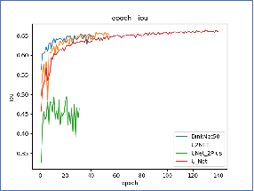

# Road_Extraction
# Road_Extraction

编译环境是pycharm

该程序通过

+ U-net
+  U-net++
+  $U^2$-net 
+ D-linknet

四个网络 在5K 24K 120K 三个不同大小数据集上验证不同网络与数据集大小在道路提取项目的效果

并对网络添加了Attention机制，使得网络提取效果变好。

所用数据集是CVPR2018: DeepGlobe Road Extraction Challenge（全球卫星图像道路提取）比赛中，的公开数据集。

比赛数据集包含6226张训练图像，1243张验证图像，以及1101张测试图像。所有的图像尺寸均为1024*1024，图像来源于泰国、印度、印度尼西亚，图像场景包括城市、乡村、荒郊、海滨、热带雨林等多个场景。

最终网络在24K数据集上iou如下

| ** **             | **iou** | **pa** | **precision** |
| ----------------- | ------- | ------ | ------------- |
| **U-Net**         | 0.664   | 0.980  | 0.825         |
| **U****2****Net** | 0.654   | 0.980  | 0.804         |
| **D-LinkNet**     | 0.659   | 0.980  | 0.812         |
| **U-Net++**       | 0.494   | 0.972  | 0.560         |